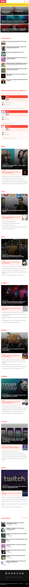
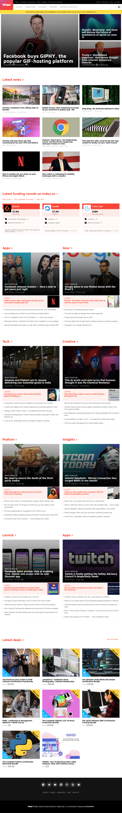
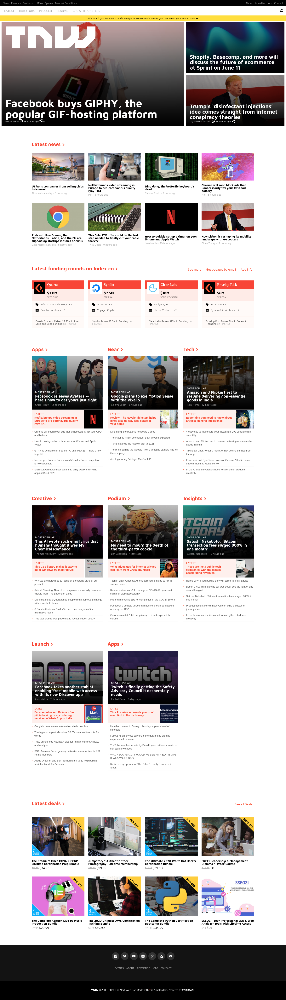

# The Next Web Clone

This project consists of replicating the The Next Web website putting emphasis on how it behaves differently depending on the size of the screen where the website is rendered.

Screenshot for screens < 782px

Screenshot for screens between 782px and 1023px

 

Screenshot for screens bigger than 1023px

## Built With

- HTML, CSS

## Live Demo

[Live Demo Link](https://rawcdn.githack.com/WinterCore/microverse-the-next-web-clone/65f9397b94466e15c5f0b48d8120962ad21f24f5/index.html)

## Getting Started

To get a local copy up and running follow these simple example steps.

### Usage
- Just open the `index.html` file

## Authors

👤 **WinterCore**

- Github: [@WinterCore](https://github.com/WinterCore)

👤 **Marilena Roque**
- Github: [@MarilenaRoque](https://github.com/MarilenaRoque)
- Twitter: [@MariRoq88285995](https://twitter.com/MariRoq88285995)
- Linkedin: [roquemarilena](https://www.linkedin.com/in/roquemarilena/)

## 🤝 Contributing

Contributions, issues and feature requests are welcome!

Feel free to check the [issues page](issues/).

## Show your support

Give a ⭐️ if you like this project!

## Acknowledgments

- Hat tip to anyone whose code was used
- Inspiration
- etc

## 📝 License

This project is [MIT](lic.url) licensed.